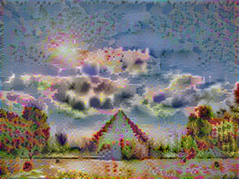
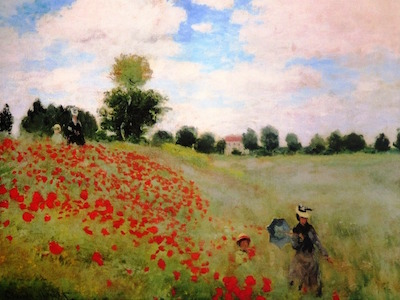

# Neural Artistic Style Transfer using Deep Learning

### Problem Definition:
- Given two images, content image and style image, the task is to produce a new stylized image using deep learning

These were the input images used (me sleeping at a hackathon and Starry Night):

### Recipe:

Here's what I did-

We define a cost function that tells how good is particular image. The cost function includes contest cost that tells how similar contents of generated iamge is with respect to the content image and also includes contest cost that tells how similar style of generated iamge is with respect to the style image.
We also define two hyper parameters alpha and beta that define relative weighting between two costs.

### Algorithm
First we intialise generated image randomly. Use graident descent to minimize J(G).

### Content Cost

We use pretrained VGG-19 network(19 layers) and specifically middle layers to measure how similar content and generatd image is. 
Let's say if I took hidden layer L and A[c][l] and A[g][l] be activations of these layers on two images.So, if these two activations are similar, then that would seem to imply that both images have similar content.We'll take the element-wise difference between these hidden unit activations in layer l, between when you pass in the content image compared to when you pass in the generated image, and take that squared.

### Style Cost

-Create an Interactive Session
-Load the content image
-Load the style image
-Randomly initialize the image to be generated
-Load the VGG19 model
-Build the TensorFlow graph:
-Run the content image through the VGG19 model and compute the content cost
-Run the style image through the VGG19 model and compute the style cost
-Compute the total cost
-Define the optimizer and the learning rate
-Initialize the TensorFlow graph and run it for a large number of iterations, updating the generated image at every step.

### Developers:
- Sahil Aggarwal [GitHub](https://github.com/sahilee26)
